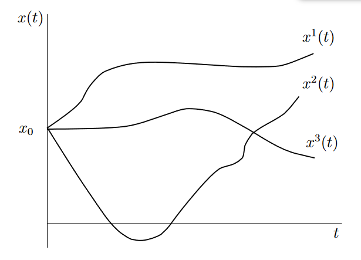
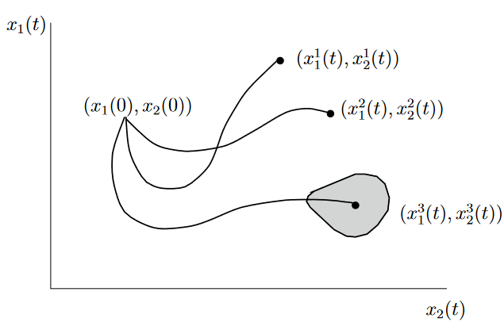
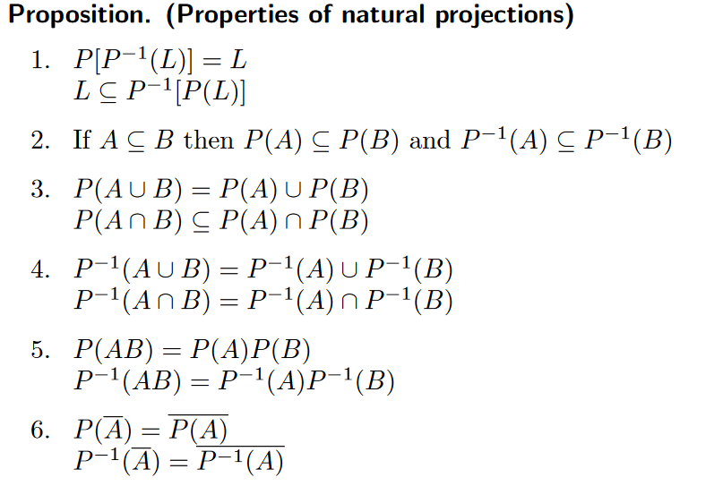
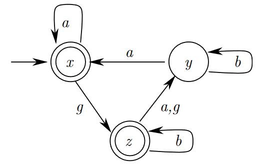

《离散事件系统导论笔记》

张正康 联系：zk_z@outlook.com

### 前言

本文为书籍$《Introduction to Discrete Event Systems》$的笔记，书籍作者为$Christos G. Cassandras$与$Stephane Lafortune$，可前往$Springer$下载。

## 1.1 介绍

​	在开始介绍离散事件系统之前，首先应该简单的介绍什么是我们所谓的系统。第二是分析系统的分类，促使我们研究离散事件的特征。从历史上看，科学家和工程师一直专注于研究和利用自然现象，这些自然现象已被万有引力定律、经典和非经典力学定律、物理化学定律等很好地模拟出来。在此过程中，我们通常要处理粒子和刚体的位移、速度和加速度等量，或流体和气体的压力、温度和流速等量，这些都是随着时间连续改变的实数量。基于这一事实，人们开发了大量数学工具和技术，用于对我们周围的系统进行建模、分析和控制。可以说，常微分方程和偏微分方程的研究目前为系统分析和控制提供了主要的基础架构。

​	但是，在我们这个日益依赖电脑的科技世界的日常生活中，越来越多的量是离散的，尤其是整数部分，比如有多少库存，天上有多少飞机。并且我们使用和依赖的许多流程都是瞬时 "事件"，如按下一个按钮、敲击一个键盘键，越来越多我们发明的事物变为事件驱动的。

## 1.2 系统和控制基础

​	这一章主要进行非正式的介绍系统理论的基本概念。在此过程中，我们将确定系统区分和分类的基本标准。

### 1.2.1 系统概念

​	系统是一个原始的概念，像集合和投影一样，最好的办法是直觉而不是一个确切的定义。但可以提供文献中的一些定义进行参考。

​	&#9670;自然界或人类将各种事物聚集或组合在一起，形成一个整体或复杂的整体（《美国百科全书》）。

​	&#9670;有规律地相互作用或相互依存的一组项目，形成一个统一的整体（《韦伯斯特词典》）。

​	&#9670;部件的组合，共同作用以实现任何单独部件都无法实现的功能（《电气和电子工程师学会电气和电子术语标准词典》）。

​	这些定义中有两个突出特征。第一，一个系统是由相互作用的部分组成的。第二，一个系统与其要执行的功能相关联。值得指出的是，一个系统未必与物理对象和自然规律关联，比如经济机制，模拟人类行为和人口动态。

### 1.2.2 输入输出模型过程

​	我们的主要工作是对系统进行定量分析，开发设计、控制和明确测量系统性能的技术。我们可以将模型看作一个可以复制系统行为本身的装置，为了更加准确，我们需要一些数学方法描述这种行为。为了展现模型模型过程，我们从给定系统的一系列可测的变量开始，例如粒子的位置和速度，电路中的电压和电流。通过一段时间的测量，我们可以收集到数据。接下来，我们选择这些变量中的一个子集，并假设我们有能力随时间改变它们。这就定义了一组时间函数，我们称之为输入变量
$$
{u_1(t),...,u_p(t)}\quad t_0\leq t \leq t_f \tag{1.1}
$$
之后，选择其他的变量集合，当改变$u_1(t),...,u_p(t)$时我们可以直接策略他们，因此定义出一组输出变量
$$
{y_1(t),...,y_m(t)}\quad t_0\leq t \leq t_f \tag{1.2}
$$
这种形式可以被描述为系统的输入“响应”。注意，这里有一些变量既不属于输入，也不属于输出，有时被称之为抑制输出变量。

​	为了简化概念，将输入和输出通过向量形式表现，写作
$$
\pmb{u}(t)=[u_1(t),...,u_p(t)]^T
\\ \pmb{y}(t)=[y_1(t),...,y_m(t)]^T
$$
​	为了完善数学模型，我们合理的假设在输入和输出之间存在一定的数学关系，因此我们假设定义如下函数
$$
y_1(t)=g_1(u_1(t),...,u_p(t)),\dots,y_m(t)=g_m(u_1(t),...,u_p(t))
$$
并且获得数学形式上的系统模型
$$
\pmb{y}=\pmb{g(u)}=[g_1(u_1(t),...,u_p(t)),\dots,g_m(u_1(t),...,u_p(t)]^T\tag{1.3}
$$
​	这是一个最简单的模型过程，如图1.1所示

			<!--块级封装-->
    
	<!--将图片和文字居中-->
    
     		<!--换行-->
    
 图1.1 简单模型过程
 	<!--标题-->
    

​	$\blacksquare$ 例1.简单电路，假设我们可以调整源电压$V$，需要测量输出电压$v$，我们获得模型图1.3(a)，假设电压源固定，我们有一个可调整电阻$r$，我们的模型为图1.3(b)，如果$V$和$r$都是可调整的，我们希望得到电流$i$的规律，模型为图1.3(c)。对于同样的内部系统，可能会有不同的模型，但变量之间的函数关系不会改变，改变的是输入和输出量的选择。

			<!--块级封装-->
    
	<!--将图片和文字居中-->
    
     		<!--换行-->
    
 图1.2 简单电路系统
 	<!--标题-->
    

			<!--块级封装-->
    
	<!--将图片和文字居中-->
    
     		<!--换行-->
    
 图1.3 电路系统三个模型
 	<!--标题-->
    

$\blacksquare$例2. 弹簧阻尼系统。假设在$t=0$时刻放置一个重物并从自然位置移动一个量$u(0)=u_0>0$，然后松手，用$y(t)$记录$t>0$时刻的位移，可知质量的运动定义了由二阶微分方程描述的谐振动

$$
m\ddot{y}=-ky\tag{1.6}
$$
初始情况$y(0)=u_0,\dot{y}(0)=0$。如果我们要研究初始位移$u(0)$和观测重物位置作为时间的函数，我们可以构建图1.4的模型。

			<!--块级封装-->
    
	<!--将图片和文字居中-->
    
     		<!--换行-->
    
 图1.4 简单机械原理和相关模型
 	<!--标题-->
    

### 静态和动态系统

​	比较两个例子，例1可以由简单的代数方程描述，例2中，输出很明显由过去的输入值决定，比如$u(0)$，并且输入输出函数是微分方程。

​	静态系统是指输出输出是不依赖过去的输入值的。动态系统是依赖于过去的输入值的。因此，确定静态系统的输出无需 "记忆 "输入历史、与动态系统正相反，在实际中，我们几乎只关注动态系统。

### 时变和时不变动态系统

​	考虑各种各样的输入和输出关系，那自然产生一个问题：当有相同的输入时，输出总是相同的吗?这就引出了另外一种系统的分类。在例子2中，若把重物换成装满水的桶，当开始时，水就逐渐漏出。在$ t = 0 $时施加位移 $u_0$，并在时间间隔$[0,t_1]$内对系统进行观测，之后再将其放回原位，在时间间隔$[t_1,2t_1]$上重复过程。则系统的表现是不同的，由于桶的质量改变了。

​	返回输入输出函数关系式1.3，当时我们假设$g(\cdot{})$是时不变的，那更一般的表达式为
$$
\pmb{y}=\pmb{g}(\pmb{u},t)\tag{1.8}
$$
其中让$g(\cdot{})$更明确取决与时间变量$t$。此时我们明确了时变系统。对于时不变系统，如果其满足下列性质：

​	对于任意$ τ $，如果输入$ u(t)$ 导致输出$ y(t)$，那么输入$ u(t - τ ) $导致输出$ y(t - τ )$ 。

			<!--块级封装-->
    
	<!--将图片和文字居中-->
    
     		<!--换行-->
    
 图1.5 时不变系统特性
 	<!--标题-->
    

### 1.2.3 状态概念

​	粗略地说，系统在某一时刻 t 的状态应以某种可测量的方式描述其在该时刻的行为。在系统理论中，状态一词的含义要精确得多，是建模过程和许多分析技术的基石。

**定义**. 系统在$ t_0 $时刻的状态是指在$ t_0 $时刻所需的信息，在所有$ t ≥ t_0 $时刻，输出$ y(t) $由这些信息和$ u(t),t ≥ t_0 $唯一确定。

​	与输入和输出类似，状态也通常是一个向量，记作$\pmb{x}(t)$,组成这个向量的$x_1(t),\dots,x_n(t)$叫做状态变量。

### 1.2.4 状态空间模型过程

​	有了系统状态的概念，我们可以加强建模过程，除了选择输入输出变量，我们还应该选择状态变量，建模过程包括确定涉及输入$ u(t)$、输出$ y(t)$和状态$ x(t) $的适当数学关系。这些关系正是我们所说的系统动力学。这就引出接下来的定义：

**定义**. 给定$ x(t_0)$和函数 $u(t),t≥t_0$，指定所有$ t≥t_0$时的状态$ x(t) $所需的方程组称为状态方程。

**定义**. 系统的状态空间通常用$ X $表示，是状态可能取值的所有集合。

​	状态方程有不同的形式，在大部分系统和控制学中，是基于微分方程的形式
$$
\pmb{\dot{x}}(t)=\pmb{f}(\pmb{x}(t),\pmb{u}(t),t)\tag{1.9}
$$
​	当我们能完全确定以下方程组时，我们就可以说已经得到了一个系统的状态空间模型：
$$
\pmb{\dot{x}}(t)=\pmb{f}(\pmb{x}(t),\pmb{u}(t),t)\quad\pmb{x}(t_0)=x_0\tag{1.10}
$$

$$
\pmb{y}(t)=\pmb{g}(\pmb{x}(t),\pmb{u}(t),t)\tag{1.11}
$$

其中，式子(1.10)是指定初始条件的状态方程，式子(1.11)是输出方程。我们在选择状态变量时，有相当大的灵活性，不过，通常情况下，直觉、经验以及作为状态变量的自然物理量的存在，都会带来良好的状态空间模型。

**备注**：对于一个静态系统，其状态一直保持不变，$\pmb{\dot{x}}(t)=0$。对于一个时不变系统，函数$f,g$没有明确的的取决于时间，我们可以写作$\pmb{\dot{x}}(t)=\pmb{f}(\pmb{x}(t),\pmb{u}(t))$和$\pmb{y}(t)=\pmb{g}(\pmb{x}(t),\pmb{u}(t))$。

			<!--块级封装-->
    
	<!--将图片和文字居中-->
    
     		<!--换行-->
    
 图1.6 状态空间模型过程
 	<!--标题-->
    

​	在图1.1的简单的输入输出模型中，我们可以将其看作一个黑箱，这表示我们对系统的了解只能从一个输入$\pmb{u}(t)$的输出响应$\pmb{g}(u)$体现，但系统的内部运行规律是不知道的。我们的任务是通过尝试各种类型的输入并观测输出响应结果推断出黑箱的信息。

​	而状态空间建模通过状态方程反映了系统的一些额外信息，如图1.6，在这个框架中我们首先集中在推导状态方程，也就是系统的动力学，之后我们根据研究的问题选择系统的输出变量，并根据不同的输入函数得到输出。

### 线性和非线性系统

​	状态空间模型也引出了系统的线性和非线性的分类，线性是一个基本的概念，其与叠加原理联系紧密：如果一个刺激$S_1$产生了一个响应$R_1$，并且一个刺激$S_2$产生了一个响应$R_2$，那么两个刺激的叠加$S_1+S_2$，也会产生两个响应的叠加$R_1+R_2$，最简单的例子就是双倍输入产生双倍输出。

​	在数学上，我们使用符号$ g : U → Y $来表示将集合 $U $中的元素映射到集合 $Y$ 中的元素的函数$ g$，对于$ u∈U$ 和 $y∈Y$ ，我们写成$ y = g(u)$。则有如下定义。

**定义**. 函数$g$是线性的当且仅当
$$
g(a_1u_1+a_2u_2)=a_1g(u_1)+a_2g(u_2)\tag{1.21}
$$
将其扩展至向量形式
$$
\pmb{g}(a_1\pmb{u_1}+a_2\pmb{u_2})=a_1\pmb{g(u_1)}+a_2\pmb{g(u_2)}\tag{1.22}
$$

### 1.2.5 动态系统采样路径

​	回到式子1.10，如果我们考虑标量情况
$$
\pmb{\dot{x}}(t)=\pmb{f}(\pmb{x}(t),\pmb{u}(t),t)\tag{1.27}
$$
如果我们选择特定输入函数$u(t)=u^1(t)$和一些初始值在时间$t=0,x(0)=x_0$。则微分方程的解是一个特定函数$x^1(t)$，如图1.9。通过改变输入函数$u(t)$，则能形成输入函数家族$u^1(t),u^2(t),...,$则也能获得一个解的家族$x^1(t),x^2(t),...,$每一个都描述了状态随时间的改变情况，每个函数家庭的成员都是系统该状态方程的样本路径，或者称为状态轨迹。

			<!--块级封装-->
    
	<!--将图片和文字居中-->
    
     		<!--换行-->
    
 图1.9 状态方程的状态轨迹
 	<!--标题-->
    

​	当模型中存在多个状态变量时，每个状态变量都有一条对应的样本路径。n 维状态向量 $x(t)$ 的所有可能取值定义了一个 n 维空间。假设我们将 t 固定在给定的采样路径上；这就指定了该空间中的一个点（矢量）。随着 t 的变化，会访问不同的点，从而定义一条曲线，我们也可以将其视为系统的状态轨迹。图1.10表示了一个二维的情况，初始条件$(x_1(0),x_2(0))$对应于该空间中的一个点。对于输入函数 $u(t)=u^1(t)$，状态用$(x_1^1(t),x^1_2(t))$表示。随着 t 的变化，$(x^1_1(t),x^1_2(t)) $代表一个新的点。在数学上，这种表示法相当于从函数$ x1(t)、x2(t) $中去掉变量 t，得到某个函数 $h(x1,x2) = 0$。

​	这种表示法在考虑一些问题时特别有用，例如从给定的初始条件出发，能否达到特定的状态或状态集？在图 1.10 中，$(x1,x2)$ 空间中的阴影区域描述了这样一个理想状态集，我们可以看到，至少有一条样本路径（即某个输入函数）允许系统到达该区域。

			<!--块级封装-->
    
	<!--将图片和文字居中-->
    
     		<!--换行-->
    
 图1.9 二维情况的状态轨迹
 	<!--标题-->
    

### 1.2.6 状态空间

​	在大部分情况下，状态变量的值都是实数，基于微分方程得到系统模型，实际上，状态变量不取一个整数或者一个给定的离散集合，例如{开，关}，{红，绿，蓝}没什么大不了。我们应始终牢记的是，建模过程允许根据相关应用或问题，灵活定义系统的状态、输入和输出。

### 连续状态和离散状态系统

​	另一个系统的分类是基于状态空间的自然选择。在连续状态模型中，状态空间$X$是一个连续体，由所有 n 维实数（有时是复数）向量组成，一般来说是有限维数。在离散状态模型中状态空间是离散集合，典型的状态轨迹是片段常函数，因为只允许状态变量在离散的时间点从一个离散的状态值跳转到另一个离散的状态值。当然，在很多情况下，混合模型可能是合适的，也就是说，有些状态变量是离散的，有些是连续的。

​	离散状态系统的动态行为通常更容易可视化。这是因为状态转换机制通常基于简单的逻辑语句，其形式为 "如果发生了特定的事情，且当前状态为$ x$，那么下一个状态就会变成 $x'$。但是从数学上形式化的表达和求解状态方程更加复杂，另一方面，连续状态模型最终归结为微分方程的分析，而微分方程有许多数学工具和通用求解技术。

### 确定和随机系统

​	回顾状态的定义，我们需要预测$t=t_0$时刻后系统所有的未来行为，假设知道所有$ t ≥ t0$ 的输入$ u(t)$。后一种假设并不总是合理的，因为它排除了大自然对给定模型输入的不可预测的影响。例如电路中可能会有噪声，通过预测未来降雨量判断蓄水池液位也是几乎不可能的，不过，我们可以建立现实的降雨概率模型，并将其纳入基于状态的系统模型中。实际生产中，也会有随机的机器故障，工人罢工，原材料输送延误等只能得到一个概率机制。当然，状态方程仍然描述系统的动态行为，但如果$u_1(t),u_2(t)$在时间$t$上不是确定的，那么状态值$x(t)$也不是确定的。

​	因此出现了另一种系统分类，如果至少有一个输出变量是一个随机变量，则为随机系统。否则，系统是确定性的。一般来说，随机动态系统定义了一个随机过程，其行为只能通过概率描述。因此，在一个确定性系统中，给定输入，则状态是可以估计的。在随机系统中，状态是一个随机向量，而只有其概率分布函数才能进行评估。

### 1.2.7 控制概念

​	我们用$r(t)$表示系统预期行为的参考信号，则输入到实际系统的控制信号为
$$
u(t)=\gamma(r(t),t)\tag {1.36}
$$
​	这种关系被称为控制律。一方面给定函数$r(t)$描述了系统的与其行为；一方面作为控制者，我们选择$u(t)=\gamma(r(t),t)$作为系统的输入函数。该式可扩展至向量形式。
$$
\pmb{u}(t)=\pmb\gamma(\pmb{r}(t),t)\tag {1.37}
$$

			<!--块级封装-->
    
	<!--将图片和文字居中-->
    
     		<!--换行-->
    
 图1.15 控制输入的状态空间模型
 	<!--标题-->
    

### 1.2.8反馈概念

​	使用任何关于系统的有用信息去持续的调整系统输入。反馈的关键特性是更正，尤其是存在扰动时。

​	数学上，使用反馈来扩展式$1.37$的控制律，使用参考值$r(t)$，观测输出值$y(t)$，或者状态$x(t)$。写出更一般的控制律形式
$$
\pmb{u}(t)=\pmb\gamma(\pmb{r}(t),\pmb{x}(t),t)\tag {1.39}
$$

#### 开环和闭环系统

			<!--块级封装-->
    
	<!--将图片和文字居中-->
    
     		<!--换行-->
    
图1.17 开环和闭环系统
 	<!--标题-->
   

​	在图1.15中加入反馈对系统进行了更详细的分类：系统的控制输入形式为$\pmb{u}(t)=\pmb\gamma(\pmb{r}(t),t)$称为开环系统。系统的控制输入形式为$\pmb{u}(t)=\pmb\gamma(\pmb{r}(t),\pmb{x}(t),t)$称为闭环系统。

​	在闭环系统中，无论输出如何，输入都保持固定。在开环系统中，输入取决于其对输出造成的影响。在闭环情况下，假设反馈的信息是某个状态变量的函数，则将其包含在控制律$\pmb\gamma(\cdot)$。注意也许并不是我们模型中所有的状态变量都可取。

​	闭环系统的优势：

1.系统的期望行为可以抗干扰。

2.系统的期望行为更大容忍建模过程中的参数误差

3.输出$\pmb{y}(t)$可以自动跟踪期望信号$\pmb{r}(t)$通过持续检测缩小差值$(\pmb{y}(t)-\pmb{r}(t))$，也被称为误差信号。

​	闭环系统的缺点:

1.需要传感器或者其他设备监控输出并对控制器提供必要的信息。

2.以系统增益来衡量，反馈可能对系统的整体性能造成影响

3.反馈在改善问题时可能会给系统带来其他一些问题。

### 1.2.9 离散时间系统

​	我们只在离散时间点上定义输入输出变量，即可得到离散时间系统。与连续时间系统相比，其理由有：

1.我们可能用作系统组件的任何数字计算机都是以离散时间方式运行的。计算机识别或控制的任何变量都只在与内部 "时钟刻度 "相对应的时间时刻进行运算。

2.许多连续时间系统模型只能被计算机求出数值解，其生成的解是连续时间模型的离散化版本。若最终解是离散模型则以离散模型开始是合理的

3.因为数字硬件和计算机技术的进步。基于离散时间模型的数字控制技术通常具有相当大的灵活性、速度和低成本。

4.一些系统具有内在的离散时间，例如基于数据的经济模型。

			<!--块级封装-->
    
	<!--将图片和文字居中-->
    
     		<!--换行-->
    
图1.19 连续时间和离散时间采样路径
 	<!--标题-->
   

​	在离散时间模型，时间线被认为是由一系列时间点$t$组成的间隔序列，其间隔都等于常数$T$，被称为采样间隔。

​	注意，时间的离散化并不代表状态空间的离散化。图19中，离散时间采样路径是片段的，但我们仍可取实数域的任何值。

​	实际上所有的框架模型都可被离散化，其中输入和输出函数$\pmb{u}(t)$和$\pmb{y}(t)$被序列$\pmb{u}(k)$和$\pmb{y}(k)$替换，状态$\pmb{x}(t)$被$\pmb{x}(k)$替换，则基于状态的模型变为
$$
\pmb{x}(k+1)=\pmb{f}(\pmb{x}(k),\pmb{u}(k),k),\qquad\pmb{x}(0)=x_{0}\tag {1.43}
$$

$$
\pmb{y}(k)=\pmb{g}(\pmb{x}(k),\pmb{u}(k),k)\tag {1.44}\qquad\qquad\quad
$$

在描述系统动态行为时，差分方程取代了微分方程为
$$
\pmb{x}(k+1)=\pmb{A}(k)\pmb{x}(k)+\pmb{B}(k)\pmb{u}(k)\tag {1.45}
$$

$$
\qquad\pmb{y}(k)=\pmb{C}(k)\pmb{x}(k)+\pmb{D}(k)\pmb{u}(k)\tag {1.46}
$$

若为非时变系统，则为
$$
\pmb{x}(k+1)=\pmb{A}\pmb{x}(k)+\pmb{B}\pmb{u}(k)\tag {1.47}
$$

$$
\qquad\pmb{y}(k)=\pmb{C}\pmb{x}(k)+\pmb{D}\pmb{u}(k)\tag {1.48}
$$

其中$\pmb{A,B,C,D}$均为包含系统参数的常数矩阵。

## 1.3 离散事件系统

​	当系统的状态空间被自然的通过一个离散集合像$\{0,1,2,...\}$，并且状态变迁只在离散的时间点被观测到，我们把这种状态变迁叫做**事件**，这种系统叫做**离散事件系统**。

### 1.3.1 事件的概念

​	一个事件应该是瞬间发生，并且造成一个状态值过渡到到另一个值。一个事件可能与所采取的具体行动有关（例，有人按了一个按钮）。它也可以被看作是由自然规律决定的自发事件（例，计算机因某种复杂到难以理解的原因而宕机）。也可能是几个条件突然全部满足的结果（例，水箱中的液位刚刚超过给定值）。

​	我们使用符号 $e$ 表示一个事件，当一个系统被不同类型的事件影响时，我们定义所有事件集合 $E$。 

#### 事件驱动和时间驱动

​	在连续状态系统中，系统状态随时间改变，将这种系统称为时间驱动系统。此时，时间变量是一个自然独立量作为输入，状态和输出的函数参数。

​	在离散状态系统，状态改变只在即时变迁的点。对于每一个变化都可对应一个事件。若对于基于时钟的事件发生，假设存在一个时钟可以测量时间，若：

1.在每一个滴答时钟都有一个事件$e$从事件集$E$中被选中，若无事件发生，则有一个空事件，也是$E$的元素，其性质为系统状态不变。

2.在不同的时间时刻（不一定事先知道，也不一定与时钟滴答声一致），某个事件 $e$ 会 "宣布 "它正在发生。

​	在1中，通过时钟，状态变迁是同步的，时钟对单独每个可能的状态变迁负责。在2中，每一个事件定义了一个独立的过程，状态变迁是组成这些异步并发事件过程的结果，这些过程也不必是相互独立的。

​	1和2之间的区别说明了时间驱动和事件驱动的关系。连续状态系统是自然时间驱动的。在离散状态系统中，取决于状态变迁是否是通过时钟同步或者像方案2的异步发生。

### 1.3.2 DES特性

​	1.状态空间是离散集合。

​	2.状态变化是事件驱动的。

​	一个离散事件系统是一个离散状态，事件驱动的系统，其状态演变取决于异步离散事件的发生。

​	例子：机器状态{开，关}，计算机运行程序{等待输入，运行中，结束}，任何离散实体如货币，人，产品都有一个自然非负整数状态空间，棋类游戏，每种配置都定义了一个空间。

​	Remark：离散时间系统包含了离散事件系统和连续变量动态系统。一个DES也许是通过连续或者离散时间建模的。

### 1.3.3 研究DES的三层抽象

​	我们通常用事件的时间序列表示DES的采样路径。
$$
(e_1,t_1),(e_2,t_2),(e_3,t_3),(e_4,t_4),(e_5,t_5),(e_6,t_6),(e_7,t_7)\tag{1.49}
$$
第一个事件是$e_1$并且在$t_1$时间发生，以此类推。

​	考虑一个给定系统能执行的所有事件的时间序列的集合，我们将其称为时间语言模型。语言：来源于将事件集合$E$称之为字母表，事件的有限序列称为单词。

​	将一个事件连续发生的间隔时间关联至一个概率分布函数，则称为随机时间语言模型。随机时间语言模型列出所有可能的采样路径和相关信息。

​	随机时间语言模型最为详细，包含事件发生的统计信息，排序，确切次数等。若去除统计信息，则为时间语言模型。如果从时间语言模型删除时间信息，则为语言，它是包含所有事件的可能排序的集合。则其事件序列写为
$$
e_1,e_2,e_3,e_4,e_5,e_6,e_7
$$
​	恰当的选择抽象层面取决于分析的对象，在大多数时刻，只需用系统的逻辑行为，即事件的发生顺序。

### 1.3.5 混合系统

			<!--块级封装-->
    
	<!--将图片和文字居中-->
    
     		<!--换行-->
    
图1.30 混合系统举例
 	<!--标题-->
   

	

​	举例来说，空的容器通过图中的流入点正在被一些液体加到期望值。以DES层面分析，这是一个简单的事件驱动组成的队列过程。$v_1$打开，一个容器被移动到填充操作位置。填充站之前的设置过程花费一些时间。当一个新容器准备好被填充，一个信号通过$v_2$被发送到时间驱动部分来启动液流，填充过程通过时间驱动发生。流体控制开关$v_3$表示选择恰当的流速：a.满速率，只要容器不满并且水槽中液位为正。b.流入率，如果水槽是空的时候的流入过程。c.零，当容器装满或者没有容器执行填装操作。注意此时系统有两个传感器，a.当容器已经到达期望装填液面，b.当水槽为空影响了流体控制函数。事件驱动和时间驱动是相互影响的，对于这种系统我们可以称为混合。

​	但是，DES不应该总是被看做一个抽象的混合系统，反之亦然。有时我们需要混合系统的视角简化复杂的DES。例如，互联网是一个纯事件驱动系统，类似一个队列模型，然而当数据包的数量太大，我们可以采用流体流动的视角，将数据包看作流体分子，缓冲区作为水槽，构建时间流动的微分方程。可以把缓冲区的空和满当作两个事件，并且最终作为一个混合系统。

### 1.3.6 构建离散事件系统

​	有两种主要的方法。如果集中在高等级的事件驱动行为，首先选择一个恰当的事件集，然后定义一组状态去捕获不同系统配置，并适应所选的事件集。之后基于系统的动态行为构建变迁结构。

​	如果集中在连续或者混合系统的监督控制，抽象技术将详细的连续或者混合模型构建为一个纯离散的，也就是说，通过一些等价转换概念，连续状态空间被分成有限个分区，在分区元素之间的可行变迁构成了离散行为。为了获得被抽象过的离散事件模型，也许从时间和空间对系统的连续微分方程都进行离散化处理。虽然其内部动力学行为是时间驱动的，但将模型作为事件驱动分析，对于每一个离散时钟刻度都做一个离散变迁。

## 1.4 系统分类总结

​	系统的分类没有排他性，它们有助于描述系统和控制理论不同方面的范围，并帮助我们辨别离散事件系统的关键特征。

​	&#9670;  **静态和动态系统**。在静态系统中，输出总是独立于过去输入的值。动态系统输出取决于过去的值，通常采用微分或者差分方程描述系统的动态行为。

​	&#9670;  **时变和时不变系统**。时不变系统的行为不随时间而改变，也被称为静止性，这说明我们可以对他进行一个特定输入，并且其输出总是相同。

​	&#9670;  **线性和非线性系统**。线性系统满足条件 $\pmb{g}(a_1\pmb{u_1}+a_2\pmb{u_2}) = a_1\pmb{g}(\pmb{u_2})+a_2\pmb{g}(\pmb{u_2})$，其中$u_1, u_2$是输入向量，$a_1, a_2$是实数，$g(\cdot)$是输出结果。线性时不变动态系统以状态空间模型描述。

​	&#9670;  **连续状态和离散状态系统**。在连续状态系统，状态变量通常是任何实数或者复数。在离散状态系统，状态变量是离散集合的元素，比如非负整数。

​	&#9670;  **时间驱动和事件驱动系统**。在时间驱动系统中，状态随着时间而改变。在事件驱动系统，只有异步产生的离散事件使状态瞬时改变。

​	&#9670;  **确定和随机系统**。只要一个或多个输出变量是随机变量，系统就会变成随机系统。系统状态通过随机过程描述，因此需要一个概率框架来描述系统行为。

​	&#9670;  **离散时间和连续时间系统**。连续时间系统是指所有输入、状态和输出变量都针对所有可能的时间值进行定义的系统。在离散时间系统中，这些变量中的一个或多个变量只在离散的时间点上定义，通常是某些采样过程的结果。

			<!--块级封装-->
    
	<!--将图片和文字居中-->
    
     		<!--换行-->
    
图1.31 主要系统分类
 	<!--标题-->
   

	

## 1.5 系统学的目标

​	**1.建模和分析**。这是理解一个实际的系统如何工作的第一步。我们建立模型是为了再现物理系统，从数学上，在实验室或者通过仿真，如果模型精确，我们的目标是研究在不同条件下的系统行为，例如不同参数和输入函数。

​	**2.设计和综合**。一旦我们掌握较为精确的建模技术，我们就解决了如何构建一个我们期望的模型的问题。因此我们试着将不同部分组合在一起并选择参数达到满意的设计，

​	**3.控制**。这是基本设计之后的下一步，我们选择各种输入函数确保系统会在各种（可能不利的）操作环境下达到期望效果。同样，我们需要一个模型测试我们想出的各种控制方法。也需要使选择正确的控制过程尽可能的高效。

​	**4.性能评估**。在系统被设计和控制好之后，解决系统表现如何的问题。系统性能的衡量标准通常可能是主观的或取决于应用的。

​	**5.优化**。给定一个系统，我们可以设计和控制它达到一些期望表现，那我们会问：我们如何控制它达到尽可能最好的效果呢？实现这一目标需要开发新的分析实验技术。

​	性能评估和优化过程如图1.32，而其输出的评估函数的形式为
$$
J[x(0),x(1),...,x(K),u(0),u(1),...,u(K)]=\phi[x(K)]+\sum_{k=0}^{K}L[x(k),u(k)]\tag{1.50}
$$
这在时间区间$[0,K]$上定义了一个评价指标。如果$J(\cdot)$表示成本，则$L[x(k),u(k)]$是系统在状态$x(k)$时使用控制信号$u(k)$的操作成本。同样，$\phi[x(K)]$是在整个过程完成后结束状态$x(K)$的成本。注意$J(\cdot)$不仅取决于当前状态和输入，还取决于整个时间区间的历史值，控制序列$x(0),x(1),...,x(K)$的选择是为了最大或最小化$J(\cdot)$

## 总结

​	从历史上看，我们研究系统中的压力，温度，速度等都是涉及时间的连续变量，将这些系统称之为连续变量动态系统，其建模和分析依赖于微分和差分方程的理论和技术。

​	我们主要应该熟悉系统和控制理论概念是状态，采样路径和反馈。一个基本的状态空间模型由一系列方程组成，描述状态变量随时间演化的过程。

​	离散事件动态系统或者离散事件系统其状态空间是离散的并且其状态只能随着时间推移，以异步发生的瞬态事件改变。DES 的采样路径通常是时间的片断常函数。传统的微分方程不适宜描述其不连续的行为。

​	DES主要的元素是(a).离散状态空间，记作$X$,(b).离散事件集合，记作$E$。

​	为了研究DES的数学模型，首先要确定是否要观测采样路径。(a). 只需要状态序列，或(b). 含有状态变迁发生时间点的状态序列。这个区别产生了时间和无时间模型。时间模型包含了随即元素。

​	我们经常遇到DES，比如计算机，通信，制造，软件和交通系统，队列系统经常被作为构建对许多DES类型进行建模。

​	具有基本连续可变动态特性的复杂自动化系统的高层行为通常被建模为 DES，以便进行监督控制和诊断。有时，这种复杂系统被详尽的建模去捕捉事件驱动和时间驱动的交互行为，这种叫做混合系统。

# 第二章 语言与自动机

## 2.1 介绍

​	当考虑DES的状态演变，首先应该关心的是被访问状态和关联的事件造成的的状态变迁，本章的第一个目的是用讨论DES语言模型和表示DES模型。第二个目的是介绍和描述两种形式化模型的第一种，自动机。其优势是直观，方便使用，便于组合操作，在有限状态下便于分析。但缺点是缺少结构，这导致了当模拟复杂系统时很大的状态空间。然而，学习离散事件系统必须从自动机的学习开始。

​	第二个模型是Petri网，有更多的结构，但是一般来说没有自动机的分析能力。同时，也有其他的无时间模型如流程代数和逻辑模型。

​	第三个目的是介绍我们在研究DES时遇到的基础逻辑行为问题。我们希望有系统的方法来全面测试一个系统的逻辑行为，并保证它总是能做到它应该做的。

## 语言和自动机概念

### 2.2.1 离散事件系统语言模型

​	任何DES都有一个内部事件集E，被称作一个语言的“字母表”。并且事件的序列被称为语言的“单词”。提出问题：对于一个给定语言，我们能否构建一个系统说这个语言？或者”这个给定系统说什么语言？“

### 语言概念和定义

​	$E$是DES的字母表，我们应该假设$E$是有限的，一系列的事件发生组成了单词或者字符串。一个没有事件组成的字符串叫空串，写作$\varepsilon$，字符串长度是事件发生的个数，包含重复发生的事件，如果$s$是一个字符串，其长度记作$|s|$。空串的长度是0。

#### 语言定义

一个语言被定义在一个事件集$E$上，是一个有限长度的字符串集合，由$E$中的事件组成。

​	例，设$E=\{a,b,g\}$是事件集，我们可以定义语言
$$
L_1=\{\varepsilon,a,abb\}\tag{2.1}
$$
只有三个字符串组成，或者定义语言
$$
L_2=\{以a开头长度为3的所有可能字符串\}\tag{2.2}
$$
这个语言包含九个串，或者定义语言
$$
L_3=\{以a开头所有的有限长度字符串\}\tag{2.3}
$$
这个语言包含无数个字符串。

​	从事件集$E$的构建字符串乃至语言的关键操作就是连接($concatenation$).语言$L_1$中的字符串$abb$是由$ab$和$b$连接，$ab$又是由$a,b$连接。空串$\varepsilon$是连接的单位元：$u\varepsilon=\varepsilon u=u$对于任何字符串$u$。

​	我们将$E^*$称为$E$中元素组成的所有有限字符串组成的集合，包含空串$\varepsilon$，其中$*$操作被称为Kleene闭包。因为$E^*$包含任意长度的字符串，显然是无限的，例如，设$E=\{a,b,c\}$，那
$$
E^*=\{\varepsilon,a,b,c,aa,ab,ac,ba,bb,bc,cc,ca,cb,cc,aaa,...\}
$$
任何在$E$上的语言都是$E^*$的子集。$\emptyset,E,E^*$都是语言。

​	字符串的术语。

$tuv=s$，其中$t,u,v\in E^*$，那么

$\blacksquare$ $t$被称作$s$的前缀$(prefix)$

$\blacksquare$ $u$被称为$s$的字串$substring$。

$\blacksquare$ $v$被称为$s$的后缀$suffix$。

​	有时我们用$s/t$表示在$t$之后$s$的后缀，如果$t$不是前缀，则未定义。$\varepsilon$ 既是前缀，子串，还是后缀。

#### 语言上的运算

​	通常的集合运算，如并集、交集、差集和补集都可使用，并补充如下运算：

$\blacksquare$ 连接$Concatenation$:让$L_a,L_b\subseteq E^*$，那么
$$
L_aL_b:=\{s\in E^*:(s=s_as_b)且(s_a\in L_a)且(s_b\in L_b)\}
$$
一个字符串如果是被$L_a,L_b$中的字符串进行连接运算的，那么他是$L_aL_b$中的字符串。

$\blacksquare$ 前缀闭包$prefix-closure：L\subseteq E^*$,那么
$$
\bar{L} :=\{s\in E^*:(\exists t\in E^*)[st\in E]\}
$$
L的前缀闭包被记作$\bar{L}$,其由L中所有字符串的前缀组成。所以一般来说，$L\subseteq \bar{L}$.

如果$L=\bar{L}$，则称之为前缀闭合prefix-closed，如果一个语言L是前缀闭合，那语言L中的任何字符串的前缀也是L中的元素。

$\blacksquare$ Kleene闭包：$L\subseteq E^*$那么
$$
L^*:=\{\varepsilon\}\cup L\cup LL\cup LLL\cup \cdots
$$
这是与E相同的操作，只是元素是字符串，$L^*$中的元素由有限个L中的元素连接组成，也包含空串$\varepsilon$。注意 * 操作是幂等的：$(L^*)^*=L^*$

$\blacksquare$ 后语言post-language:$L\subseteq E^*$和$s\in \bar{L}$。那么在s之后的L的后语言被记作$L/s$，是语言
$$
L/s:=\{t\in E^*:st\in L\}
$$
根据定义，如果$s\notin\bar{L},那么L/s=\emptyset$.

​	请注意，在表达式中涉及对语言的多个操作时，应首先应用前缀封闭和Kleene封闭，而连接总是先于交集、并集和集合差等操作。

​	为了准确，做出以下规定：

i) $\varepsilon\notin\emptyset$

ii) $\{\varepsilon\}$是一个只包含空串的非空语言

iii) 若$L=\emptyset$,则$\bar{L}=\emptyset$,若$L\ne\emptyset$,则$\varepsilon\in\bar{L}$

iv) $\empty^*=\{\varepsilon\}且\{\epsilon\}^*=\{\varepsilon\}$

v)$\emptyset L=L\empty=\empty$.

#### 语言和字符串投影（Projection）

​	另一个经常使用的运算叫自然投影，或者投影。从一个事件集$E_l$到一个更小的事件集$E_s$，其中$E_s\subset E_l$，自然投影被记作字母P，其定义为：
$$
P:E_l^*\rightarrow E_s^*
$$
其中
$$
P(\varepsilon):=\varepsilon\\
P(e):=\begin{cases}
e\quad if\space e\in E_s\\
\varepsilon\quad if\space e\in E_l\setminus E_s
\end{cases}
\\ P(se):=\quad P(s)P(e)\space for\ s\in E_l^*,e\in E_l
$$
从定义中可看到，投影操作是从较大的事件集$E_l$中提取一个字符串，并删除其中不属于较小的事件集（$Es$）的事件。

​	相关的逆投影为：
$$
P^{-1}:E_s^*\rightarrow2^{E_l^*}
$$
其定义为
$$
P^{-1}(t):=\{s\in E_l^*:P(s)=t\}
$$
（给定一个集合$A,2^A$表示集合A的幂集，即集合A的所有的子集组成的集合。）给定一个较小事件集合的字符串输入，其逆投影返回一个较大事件集合中字符串的集合，集合中字符串的投影均为输入。

​	可以将投影的概念扩展到语言。对于$L\subseteq E_l^*$:
$$
P(L):=\{t\in E_s^*:(\exist s\in L)[P(s)=t]\}
$$
对于$L_s\subseteq E_s^*$,
$$
P^{-1}(L_s):=\{s\in E_l^*:(\exist t\in L_s)[P(s)=t]\}
$$

			<!--块级封装-->
    
	<!--将图片和文字居中-->
    
     		<!--换行-->
    
自然投影的性质
 	<!--标题-->
   

	

### 2.2.2自动机

​	自动机是能够根据制定好的规则表示语言的一种工具。本章为自动机的形式化定义，最简单的表示自动机是他的状态变迁图。

​	设事件集$E=\{a,b,g\}$。状态变迁图如2.1.节点表示状态，标签弧表示变迁。节点集就是自动机的状态集，$X=\{x,y,z\}$，变迁的标签就是事件集的元素。自动机变迁函数可以写作$f:X\times E\rightarrow X:$

$f(x,a)=x\quad f(x,g)=z\quad ...$

概念$f(y,a)=x$表示如果自动机在状态y，那么事件a在发生时，自动机将立刻变迁到状态x，事件a发生的原因无所谓，事件可以是一个外部的输入，也可以是系统内部生成的。

			<!--块级封装-->
    
	<!--将图片和文字居中-->
    
     		<!--换行-->
    
图2.1 状态变迁图
 	<!--标题-->
   

	

​	三件事值得注意。一，一个事件可以发生而不改变状态。二，两个不同的事件也许在同一状态发生时会导致相同的变迁。若我们只观测状态z到y，我们不能区分发生了事件a还是事件g。三，函数f在定义域$X\times E$是部分函数,对于每一个事件在每一个状态上不需要全部有定义。

​	还有两个不可缺少的部分对于定义一个自动机：1.初始状态，记作$x_0$,和一个$X$的子集$X_m$表示被标识的状态。当需要对状态赋予特殊含义时，会对其进行标记，也可称为可接受状态或者终止状态。在本书中，初始状态将由一个箭头标识，标识状态是一个双环。

#### 定义 确定性自动机

​	一个确定性自动机记作G，是一个六元组
$$
G=(X,E,f,\Gamma,x_0,X_m)
$$
X是状态集。

E是G的有限事件集。

$f:X\times E\rightarrow X$是变迁函数，一般来说，f是定义域上的部分函数。

$\Gamma:X\rightarrow 2^E$是活跃事件函数（或可行事件函数）；$Γ(x)$ 是 $f (x, e) $已定义的所有事件 e 的集合，称为 G 在 x 处的活跃事件集（或可行事件集）。

$x_0$是初始状态。

$X_m\subseteq X$是标识状态集。

​	下面是一些备注。

​	状态机或者生成器也经常被用来描述自动机。如果X是有限集，则叫确定性有限自动机，缩写DFA。函数f和Γ完全通过自动机的状态变迁图描述。自动机是确定性的是因为不能有两个相同事件的标签从一个状态中出去。相反，非确定性自动机函数定义方式为$X\times E\rightarrow 2^X $,此时，有同一标签的多重变迁从一个状态出去。

​	我们允许函数 f 在其域 X × E 上部分定义，这是对计算机科学文献中自动机通常定义的一种变化，在 DES 理论中相当重要。

​	形式上来说，Γ是多余的，因为是由f派生的，当不主要讨论活跃事件函数时，指明自动机有时会省略他。恰当的选择哪一个状态被标记取决于研究的问题。事件集E包含自动机中所有的变迁标签，E中有时也包含额外的事件，这是因为要和其他自动机进行平行构成操作。

​	f可以通过递归的方式扩展到定义域$X\times E^*$:
$$
f(x,\varepsilon):=x\\
f(x,se):=f(f(x,s),e)\ for\ s\in E^*\ and \ e\in E 
$$
这个扩展定义包含了原始的f，所以可以直接使用f。

### 2.2.3 自动机的语言表示

​	考虑自动机从初始状态开始，之间的变迁路径，最终在标识状态结束，这产生了生成与标识语言的定义。

#### 定义 生成与标识语言

生成语言通过$G=(X,E,f,\Gamma,x_0,X_m)$为
$$
\mathcal{L}(G):=\{s\in E^*:f(x_0,s)is \ defined\}
$$
标识语言通过G为
$$
\mathcal{L}_m(G):=\{s\in\mathcal{L}(G):f(x_0,s) \in X_m\}
$$
一个直接的结果是，对于任何具有非空 X 的 G，$\varepsilon\in \mathcal{L}(G)$

​	语言$\mathcal{L}(G)$表示从初始状态开始沿着状态变迁图的所有的直接路径，与路径相对应的字符串是组成路径的变迁的事件标签的组合，因此，一个字符串s在$\mathcal{L}(G)$中当且仅当他相当于状态变迁图中的可行路径，或者相当于f在$(x_0,s)$处有定义。如果f在定义域上是完全函数，则$\mathcal{L}(G)=E^*$.

​	标记语言$\mathcal{L}_m(G)$是生成语言的子集，由在标识状态结束的字符串组成，一般来说没有必要是前缀闭包的。标识语言也可称为辨识语言，我们经常说给定自动机是给定语言的辨识器。

​	对于一些字符串从某一状态开始，那我们用自动机的后语言表示，使用概念$\mathcal{L}(G,x)$
$$
\mathcal{L}(G,x):=\{s\in E^*:f(x,s)is\ defined\}
$$
概念扩展到$X_{set}\subseteq X$：
$$
\mathcal{L}(G,X_{set}):=\{s\in E^*:(\exists x\in X_{set})[f(x,s)is\ defined]\}
$$
对$\mathcal{L}_m(G,x)$也一样，为了方便，$\mathcal{L}(G)=\mathcal{L}(G,x_0)$,$\mathcal{L}_m(G)=\mathcal{L}_m(G,x_0)$.当操作状态变迁图时，可能删除初始状态，这会得到空自动机，空自动机必须生成和标记空集。
